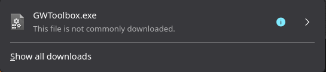
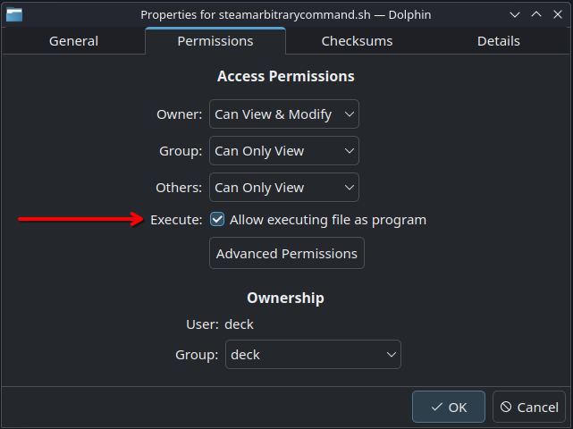
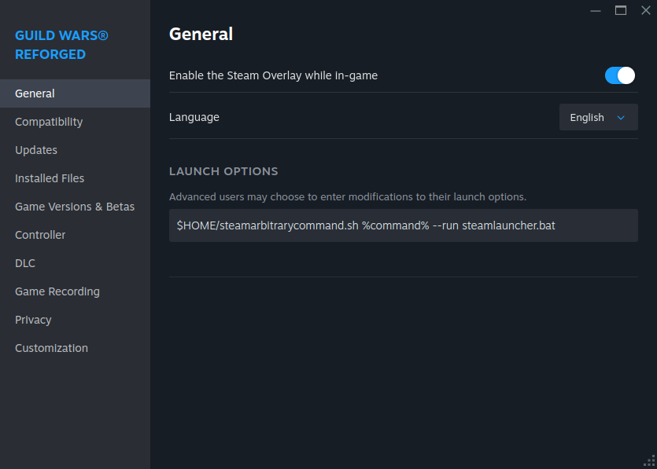

# Guild Wars Reforged on Steam Deck – Mods Installation Guide

This guide provides a step-by-step guide on how to install mods for Guild Wars Reforged on the Steam Deck. An [Automated Setup](#automated-setup) is available which will do all the heavy lifting for you. If you prefer to do the setup manually or would like to know what is happening in the background, you can jump to the [Manual Setup](#manual-setup) section and follow along there.

This guide mainly took inspiration from [this repository](https://github.com/ChthonVII/guildwarslinuxinstallguide) in regard to getting to run Guild Wars on Linux. However, since this covers all topics of getting to run Guild Wars on Linux and is very verbose, you can easily get lost in just the steps you need to take to get it to work on the Steam Deck.

## Credits

Credits to [ChthonVII](https://github.com/ChthonVII) and his contributors for their extensive guide on getting Guild Wars to run on Linux.

Credits to the [gwdevhub](https://github.com/gwdevhub) team for their GWToolbox and gMod add-ons.

Credits to Harry (Target SC), God Of Fissures, Ruine Eternelle, Farlo for their work on the Cartography Made Easy maps that are used.

## Prerequisites

* You have a Steam Deck with Guild Wars Reforged installed on it.
* You have started Guild Wars Reforged at least once.
* This guide pertains to the Steam-version of Guild Wars Reforged. Getting this to work with the ArenaNet client of Guild Wars by adding it as a non-Steam game may also work. However, it will require a little more effort on your part to find the right paths that Steam creates for non-Steam games.
* All of this is done in Desktop Mode. It's best that you connect a mouse and keyboard due to the nature of the steps involved.

## Automated Setup

This automated setup script will download and install GWToolbox++ and gMod along with a Cartography Made Easy map for Guild Wars Reforged on your Steam Deck. If you want to get a general understanding of what it will do, read the [Manual Setup](#manual-setup) section below.

**Note:** this script is only intended for use on the Steam Deck with the Steam-version of Guild Wars Reforged. It's untested on other platforms. Use at your own risk!

Open the `Konsole` application and paste (`Ctrl + Shift + V`) the following lines into it:

```sh
curl -sL https://raw.githubusercontent.com/juniordiscart/GuildWarsReforged_SteamDeck_ModInstallationGuide/main/script/automated_setup.sh > gwreforged_modsetup.sh
chmod +x gwreforged_modsetup.sh
./gwreforged_modsetup.sh
rm ./gwreforged_modsetup.sh
```

Hit `Return` to execute it.

After the script has finished, you can safely close the `Konsole` application. Now, jump to the [launch options](#guild-wars-reforged-launch-options) section to adjust the Steam launch options for Guild Wars Reforged.

## Manual Setup

The steps detailed below will guide you through the process of setting up mods Guild Wars Reforged on your Steam Deck manually.

### Download mods

Download the mods you want or need in Guild Wars. In this guide, we'll use GWToolbox++ and gMod for easy cartography. Any other mods you might want to set up are probably set up in a similar fashion.

* [GWToolbox++](https://www.gwtoolbox.com/) — **Note**: when downloading this using Firefox on the Steam Deck, Firefox may prevent you from downloading it initially. If this is the case for you, click on the arrow button and allow it to continue downloading.



* [gMod](https://github.com/gwdevhub/gMod/releases) — download the latest `gMod.dll` from GitHub.


* [Cartography Made Easy](https://wiki.guildwars.com/wiki/Player-made_Modifications/Cartography_Index) — Recommended here are either the `2017 Edition - Updated, Extended` or `Cartography Made Easy and In-game Mission Maps (IGMM) combined` versions.

### Creating the link between Guild Wars install directory and Proton runtime

First, we create a link between the actual Guild Wars installation directory and the Proton runtime which will run the Guild Wars instance. These paths will be the same on all Steam installs of Guild Wars Reforged. The `29720` directory is the AppID of Guild Wars Reforged on Steam. If you add Guild Wars as a non-Steam game, then these paths will be different and you will need to look into Steam's directories where exactly it has placed them.

* Open the `Konsole` application.
* Paste (`Ctrl + Shift + V`) the line below in the terminal, and hit `Return` to execute it:

`ln -s "/home/deck/.local/share/Steam/steamapps/common/Guild Wars"/ "/home/deck/.local/share/Steam/steamapps/compatdata/29720/pfx/drive_c/Program Files (x86)/Guild Wars"`

* Close the `Konsole` application.

### Installing GWToolbox++

Follow the steps below to copy GWToolbox++ to a convenient location for later on:

* Open `Dolphin` file manager
* Click on the `Home` directory on the left, if you're not already in `Home`
* Make sure invisible files and directories are visible (`Ctrl + H`)
* Navigate to `.local/share/Steam/steamapps/compatdata/29720/pfx/drive_c/Program Files (x86)`
* In here, create a new directory called `GWToolbox`.
* Enter the new directory and copy the `GWToolbox.exe` in here.

### Installing gMod and Cartography Made Easy

With the `gMod.dll` and cartography `.tpf` files downloaded, follow the steps below:

* Open `Dolphin` file manager
* Click on the `Home` directory on the left, if you're not already in `Home`
* Make sure invisible files and directories are visible (`Ctrl + H`)
* Navigate to `.local/share/Steam/steamapps/compatdata/29720/pfx/drive_c/Program Files (x86)`
* You should see the `Guild Wars` directory link in there, which we created earlier. Enter it.
* Copy the `gMod.dll` and cartography file next to the `Gw.exe` executable.
* Rename the `gMod.dll` to `d3d9.dll`.
* Right-click in an empty space, and create a new text file called `modlist.txt`.
* Open the `modlist.txt` file and enter a single line: `C:\Program Files (x86)\Guild Wars\{name of your cartography file}.tpf`. Make sure to adjust the line to fit the name of the cartography file you downloaded.\
* Save and close the file.

### Setting up the launcher script

With the mods we want set up in the right places, we can create the script that will launch external tools such as GWToolbox++ next to Guild Wars in the same Proton instance. This is important, since Steam generally only launches a single application when you hit the `Play` button. We need to work around it by launching a script instead that will in turn launch Guild Wars along with the mods we want.

* Open `Dolphin` file manager
* Click on the `Home` directory on the left, if you're not already in `Home`
* Make sure invisible files and directories are visible (`Ctrl + H`)
* Navigate to `.local/share/Steam/steamapps/compatdata/29720/pfx/drive_c/Program Files (x86)/Guild Wars`
* Right-click in an empty space, and create a new text file called `steamlauncher.bat`.
* Open the `steamlauncher.bat` script and paste the following contents:
```
echo off

cd /D "C:\Program Files (x86)\Guild Wars"
start Gw.exe

ping -n 15 127.0.0.1 > nul
cd /D "C:\Program Files (x86)\GWToolbox"
start GWToolbox.exe
```

Save and close the file.

The script contents above will first make the script navigate to your Guild Wars directory inside the Proton runtime launched by Steam and then start the Guild Wars application. Next, it will ping our own system a couple of times. Each ping is sent with a one-second interval, so this functions as a sleep timer before navigating to the GWToolbox directory and starting the GWToolbox process.

Secondly, we need Steam being able to execute arbitrary commands, which in this case will call on the `steamlauncher.bat` script.

* Open `Dolphin` file manager
* Navigate to a location you deem appropriate to create the script for arbitrary command from Steam. In my case, I placed the script simply in my home folder, since it's a generic script that can be used by other Steam applications if you want to.
* In here, create a `steamarbitrarycommand.sh` text file.
* Open it and paste the contents found [here](https://github.com/ChthonVII/guildwarslinuxinstallguide/blob/main/extras/steamarbitrarycommand.sh).
* Save and close the file.
* Right-click on the `steamarbitrarycommand.sh` file and select `Properties`.
* Go to the `Permissions` tab and toggle the `Execute` permission on to allow it to be executed as a program.
* Close the file properties window.



At this point, everything is in place and the setup is complete. The only thing left to do is to adjust the [launch options](#guild-wars-reforged-launch-options) for Guild Wars Reforged in Steam.

## Guild Wars Reforged Launch Options

Now that everything is in place, we can adjust the launch options for Guild Wars Reforged in Steam.

* Right-click on Guild Wars Reforged in your Steam library and select `Properties`
* In the `Launch Options` input field enter: `/home/deck/steamarbitrarycommand.sh %command% --run steamlauncher.bat`.

Using the [Automated Setup](#automated-setup) will have saved the `steamarbitrarycommand.sh` in this location. If you went through the [Manual Setup](#manual-setup) and you placed it at a different location, then you should adjust the path accordingly.



## Launch Guild Wars Reforged

When you press `Play` in Steam now, it should launch Guild Wars Reforged with your mods active! After a couple of seconds, GWToolbox++ should open up, and you should be able to use it to track your progress.


