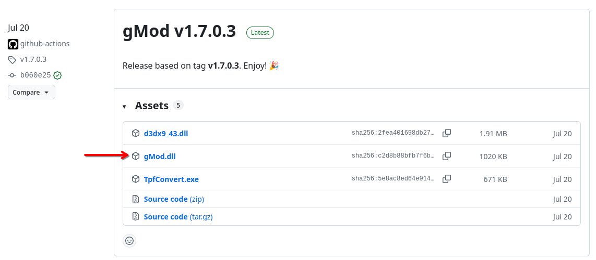
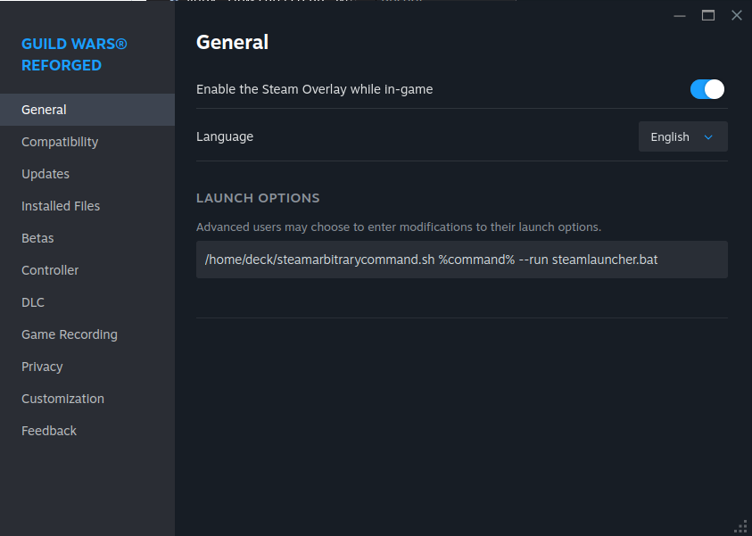

# Guild Wars Reforged on Steam Deck - Mods Installation Guide

This guide mainly took inspiration from [this repository](https://github.com/ChthonVII/guildwarslinuxinstallguide) with regards to getting to run Guild Wars on Linux. However, since this covers all topics of getting to run Guild Wars on Linux and is very verbose, you can easily get lost in just the steps you need to take in order to get it to work on the Steam Deck itself.

Credits for go to [ChthonVII](https://github.com/ChthonVII) and his contributors as they provided the foundation for me to get this working on Steam Deck.

## Prerequisites

* You have a Steam Deck with Guild Wars Reforged installed on it.
* This guide pertains to the Steam-version of Guild Wars Reforged. Getting this to work with the ArenaNet client of Guild Wars by adding it as a non-Steam game may also work, but will require a little more effort on your part to find the right paths that Steam creates for non-Steam games.
* Run Guild Wars Reforged and sign in to your account at least once. This will make running GWToolbox++ for the first time a little easier.
* All of this is done in Desktop Mode. It's best that you connect a mouse and keyboard due to the nature of the steps involved.

## Downloads

At this point, download the mods you want or need in Guild Wars. In this guide, we'll use GWToolbox++ and gMod for easy cartography. Any other mods you might want to set up are probably set up in a similar fashion.

* [GWToolbox++](https://www.gwtoolbox.com/) — **Note**: when downloading this using Firefox on the Steam Deck, Firefox may prevent you from downloading it initially. If this is the case for you, click on the arrow button, and allow it to continue downloading.


* [gMod](https://github.com/gwdevhub/gMod/releases) — simply download the latest `gMod.dll` from GitHub.



* [Cartography Made Easy](https://wiki.guildwars.com/wiki/Player-made_Modifications/Cartography_Index) — Recommended here are either the `2017 Edition - Updated, Extended` or `Cartography Made Easy and In-game Mission Maps (IGMM) combined` versions.

## Installation

First, we create a link between the actual Guild Wars installation directory and the Proton runtime which will run the Guild Wars instance. These paths will be the same on all Steam installs of Guild Wars Reforged. The `29720` directory is the AppID of Guild Wars Reforged on Steam. If you add Guild Wars as a non-Steam game, then these paths will be different and you will need to look into Steam's directories where exactly it has placed them.

* Open the `Konsole` application.
* Paste (`Ctrl + Shift + V`) the line below in the terminal, and hit return to execute it:

`ln -s "/home/deck/.local/share/Steam/steamapps/common/Guild Wars"/ "/home/deck/.local/share/Steam/steamapps/compatdata/29720/pfx/drive_c/Program Files (x86)/Guild Wars"`

* Close the `Konsole` application.

### Installing GWToolbox++

Follow the steps below to copy GWToolbox++ to a convenient location for later on:

* Open `Dolphin` file manager
* Click on the `Home` directory on the left, if you're not already in `Home`
* Make sure invisible files and directories are visible (`Ctrl + H`)
* Navigate to `.local/share/Steam/steamapps/compatdata/29720/pfx/drive_c/Program Files (x86)`
* In here, create a new directory called `GWToolbox`.
* Enter the new directory and copy the `GWToolbox.exe` in here.

### Installing gMod and Cartography Made Easy

With the `gMod.dll` and cartography `.tpf` files downloaded, follow the steps below:

* Open `Dolphin` file manager
* Click on the `Home` directory on the left, if you're not already in `Home`
* Make sure invisible files and directories are visible (`Ctrl + H`)
* Navigate to `.local/share/Steam/steamapps/compatdata/29720/pfx/drive_c/Program Files (x86)`
* You should see the `Guild Wars` directory link in there, which we created earlier. Enter it.
* Copy the `gMod.dll` and cartography file next to the `Gw.exe` executable.
* Rename the `gMod.dll` to `d3d9.dll`.
* Right click in an empty space, and create a new text file called `modlist.txt`.
* Open the `modlist.txt` file and enter a single line: `C:\Program Files (x86)\Guild Wars\{name of your cartography file}.tpf`. Make sure to adjust the line to fit the name of the cartography file you downloaded.

### Setting up the launcher script

With the mods we want set up in the right places, we can create the script that will launch external tools such as GWToolbox++ next to Guild Wars in the same Proton instance. This is important, since Steam generally only launches a single application when you hit the `Play` button. We need to work around it by launching a script instead that will in turn launch Guild Wars along with the mods we want.

* Open `Dolphin` file manager
* Click on the `Home` directory on the left, if you're not already in `Home`
* Make sure invisible files and directories are visible (`Ctrl + H`)
* Navigate to `.local/share/Steam/steamapps/compatdata/29720/pfx/drive_c/Program Files (x86)/Guild Wars`
* Right click in an empty space, and create a new text file called `steamlauncher.bat`.
* Open the `steamlauncher.bat` script and paste the following contents:
```
echo off

cd /D "C:\Program Files (x86)\Guild Wars"
start Gw.exe

ping -n 20 127.0.0.1 > nul
cd /D "C:\Program Files (x86)\GWToolbox"
start GWToolbox.exe
```
* Save the file. Keep the file open, or in reach, since we will need to revisit this script one more time after launching Guild Wars Reforged for the first time.

The script contents above will first make the script navigate to your Guild Wars directory inside the Proton runtime launched by Steam, and then start the Guild Wars application. Next, it will ping our own system 20 times. Each ping is sent with a one second interval, so this functions as a sleep timer before navigating to the GWToolbox directory and starting the GWToolbox process.

Secondly, we need Steam being able to execute arbitrary commands, which in this case will call on the `steamlauncher.bat` script.

* Open `Dolphin` file manager
* Navigate to a location you deem appropriate to create the script for arbirtrary command from Steam. In my case, I placed the script simply in my home folder, since its a generic script that can be used by other Steam applications if you want to.
* In here, create a `steamarbitrarycommand.sh` text file.
* Open it, and paste the contents found [here](https://github.com/ChthonVII/guildwarslinuxinstallguide/blob/main/extras/steamarbitrarycommand.sh).
* Save and close the file.

### Setting up Guild Wars Reforged launch options in Steam

Now that everything is in place, we can adjust the launch options for Guild Wars Reforged in Steam.

* Right click on Guild Wars Reforged in your Steam library and select `Properties`
* In the `Launch Options` input field enter: `/home/deck/steamarbitrarycommand.sh %command% --run steamlauncher.bat`. If you placed your arbitrary command script in a different location than the home folder, then adjust the line to make it point to the right location.



### Launch Guild Wars Reforged

When you press `Play` in Steam now, it should launch Guild Wars Reforged with your mods active!

If you also installed GWToolbox++, after about ~20 seconds, GWToolbox++ should now be availble for its first-time setup. Switch to the GWToolbox++ process by alt-tabbing out of Guild Wars, and proceed to let it install and hook it into Guild Wars afterwards.

After the GWToolbox++ installation is complete, close Guild Wars and open the `steamlauncher.bat` script again. In there, replace the line `start GWToolbox.exe` with `start GWToolbox.exe /quiet`. Save and close the file and start Guild Wars again from Steam. GWToolbox++ should now automatically activate ~20 seconds after the Guild Wars process has started.


